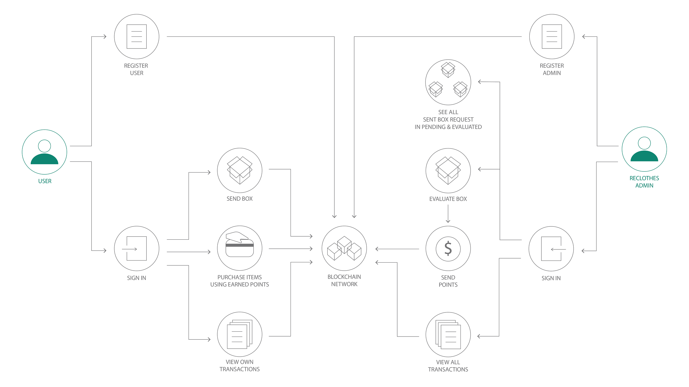
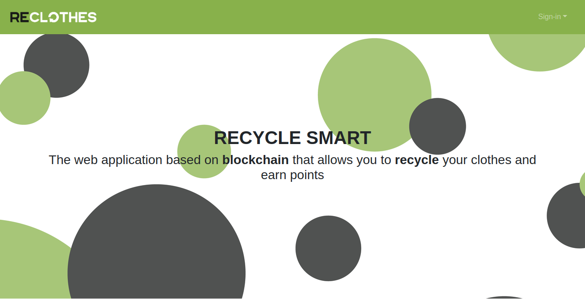
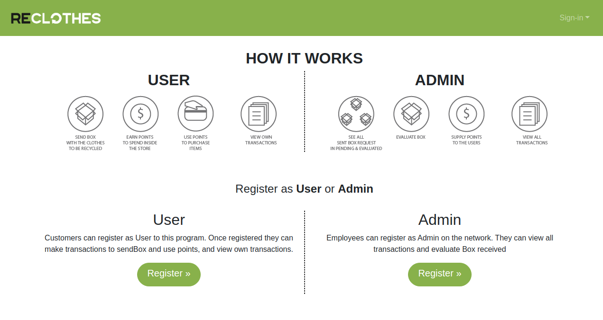

# ReClothes Dapp with Hyperledger Fabric EVM

# Overview 

> Tips: The working directory must be **`~/go/src/github.com/hyperledger/`** and all the folders must be placed inside that directory

<br>

The goal of this work is to:
1. instantiate and install [fabric-chaincode-evm](https://github.com/hyperledger/fabric-chaincode-evm)
2. run fabproxy, in order to allow communications between client and fabric network
2. run web-app to interact and test smart contract

## Prerequisite

## Requirements

- [Go](https://golang.org/dl/) (version 1.12 or greater - I used v1.14.2)
- [Docker](https://www.docker.com/) (version 17.06.2-ce or greater - I used v18.09.9)
- [Node](https://nodejs.org/en/) (version 8.9.x or greater - I used v10.5.2)
- [npm](https://www.npmjs.com/) (version 5.6.0 or greater - I used 6.13.7)

## Components

- [Fabric Sample](https://github.com/hyperledger/fabric-samples) (**check requirements above**)
- [fabric-chaincode-evm](https://github.com/hyperledger/fabric-chaincode-evm)

## Use Case

<p align="center">
  
</p>

# Steps
1. [Modify First Network](#net)
2. [Install Chaincode EVM](#install_chaincode_evm)  
3. [Fab3](#run_fab3)
    - [Compile Fab3](#compile_fab3)
    - [Run Fab3](#run_fab3)
4. [Deploy Smart Contract](#deploy)  
    - [Install Web3](#web3)
    - [Deploy Smart Contract](#smart_contract)
5. [Run Web App](#web_app) 
    - [Set up Folders](#set_up)
    - [Run](#run)
    - [Views](#views)

<a name="net"></a>
## 1. Modify First Network

For each user in Fabric it’s generated all cryptographic material to authenticate itself. By default in first-network is generated 1 User for Org1 and 1 Admin for Org2.

To add 1 or more Users we need to modify **`crypto-config.yaml`** file. 

In `crypto-config.yaml` go to 
```
Org1 -> Users -> Count
``` 
and change the number (**set Count label**) of the user accounts that we need to be generate (e.g 2)

> After running the first-network we could check the Users created. Go to repository   
`crypto-config/peerOrganizations/orgN.example.org/users` and here you can find the folder of the users created with all the cryptographic material inside

> Than running the first-network `./byfn.sh up`

<a name="install_chaincode_evm"></a>
## 2. Install Chaincode EVM

> After running the first-network 

Install the **fabric-chaincode-evm**:
1. copy the `script/network/install_evm.sh` in the repository `go/src/github.com/hyperledger/fabric-samples/first-network/script/`
2. 
```bash
docker exec -it cli bash
``` 
> You should see the following on prompt  
`root@0d78bb69300d:/opt/gopath/src/github.com/hyperledger/fabric/peer#`
3.
```bash
cd script
./install_evm.sh
exit
``` 

<a name="fab3"></a>
## 3. Fab3

Now We are going to run the fab3 proxy in order to allow communication between client and Fabric Network.

<a name="compile_fab3"></a>
## Compile Fab3

Run the following at the root of this repository `fabrich-chaincode-evm`:

```
make fab3
```

A binary named `fab3` will be created in the `bin` directory.

<a name="run_fab3"></a>
## Run Fab3

in `script/chaincode/` there's 3 `fab3_run.sh` files, each `.sh` file run an instance of fabproxy on a different *PORT* and associated to a different fabric *USER* with a different *ETH ADDRESS* generated on the fly. 

- `fab3_run.sh` will run on http://localhost:5000 and will map **User1** of **Org2**
- `fab3_run2.sh` will run on http://localhost:5001 and will map **User1** of **Org1**
- `fab3_run3.sh` will run on http://localhost:5002 and will map **User2** of **Org1** 

To run the files 

```shell
./fab3_run.sh
./fab3_run2.sh #in a second terminal
./fab3_run3.sh #in a third terminal
``` 

<a name="deploy"></a>
## 4. Deploy the Smart Contract

Next, we'll install the web3 dependency and than we are going to run `install.js` to deploy the BoxPoints smart contract.

<a name="web3"></a>
### Install Web3

Web3.js is a library that allow to deploy and interact with solidity smartcontract. 

Build the dependencies including the `web3@0.20.2` by navigating to web-app folder from the root directory and running the `npm install` command:

```bash
cd web-app
npm install
npm list web3 #To check web3 version
``` 

<a name="smart_contract"></a>
### Deploy Smart Contract

> First instance of Fab3 that run on PORT:5000 must to be in running while the deploying of smart contract.

To deploy the smart contract we have to run

```bash
node install.js
```
 
The js file will deploy the contract on the network and return the **`contract address`**. It must be copied and paste in **`dapp.js`**

<a name="web_app"></a>
## 5. Run Web Application

<a name="set_up"></a>
### Set up Folders

> Optionally you could follow this tips to test as best the web-app locally

I copied the **`web-app`** folder, in order to create 3 different folder, 1 for each user to be run

1. **`web-app-admin`**, it just match fab3 options
2. **`web-app-user1`**, you must to change localhost PORT:5001 of provider in *`dapp.js`*, and PORT:8001 of the app running in *`app.js`* at the end of the file
3. **`web-app-user2`**, you must to change localhost PORT:5002 of provider in *`dapp.js`*, and PORT:8002 of the app running in *`app.js`* at the end of the file

<a name="run"></a>
### Run 

Once is everything setted up we could run web application

```bash
cd web-app-admin
npm start
```

the application will run on **`localhost:8000`**

Repeat the same command for `web-app-user1` and `web-app-user2` that will run respectively on `localhost:8001` and `localhost:8002`

### Views

Once the application is in running on **`localhost:8000`** you should see the following view

<p align="center">
  
</p>
<br>
<p align="center">
  
</p>

