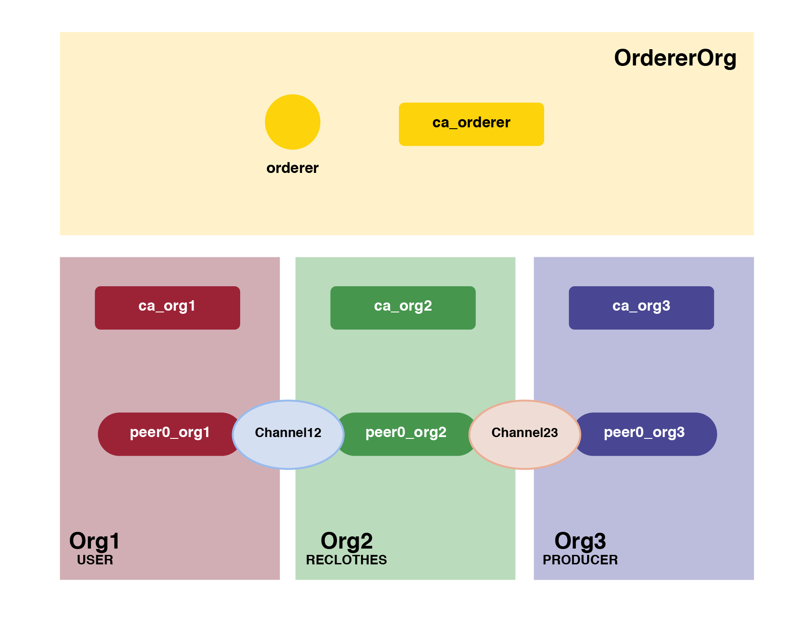

# Network

# Oveview

We are building a network of three organizations, Org1, Org2 and Org3, each of which has one peer Peer0. We have two channels, Channel12 (Org1, Org2) and Channel23 (Org2 and Org3).

  <!--img src="doc/img/net1.png" width="400"-->
  

# Table of Contents

Inside `network` folder there's two script:
- `net_up.sh` : 
  1. Generate crypto materiale for organizations
  2. Generate channel artifacts
  3. Inizialize Org1 and join to the channel
  4. Instantiate and Install evmm chaincode
- `net_down.sh` :
  1. remove all docker containers in running
  2. remove all docker volumes created

Inside `fab_script` folder:
- `fab1.sh` : new fab script
- `network-sdk-config.yaml` : this file must to be placed in the following folder `${GOPATH}/src/github.com/hyperledger/fabric-chaincode-evm/examples/`
