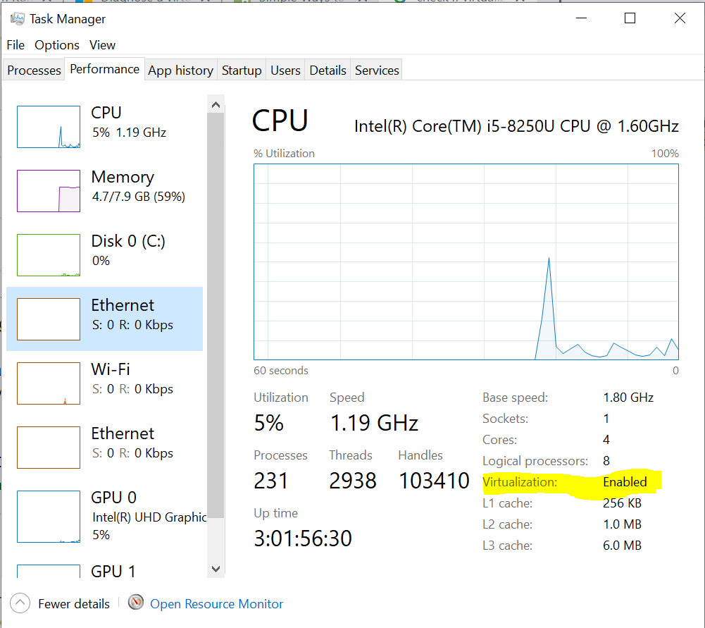
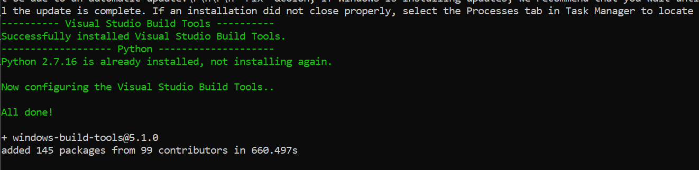
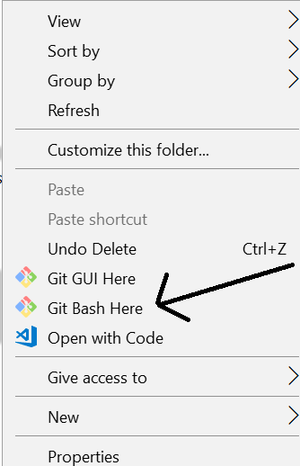
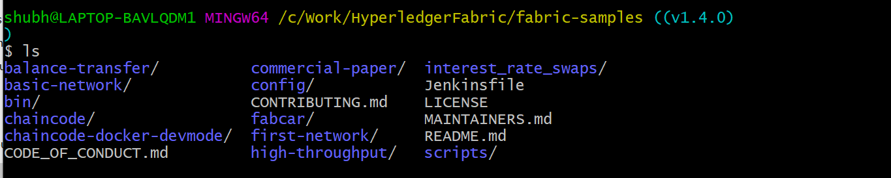
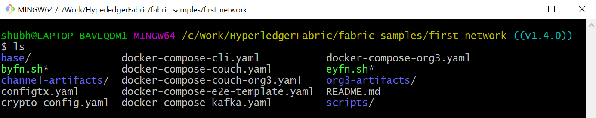
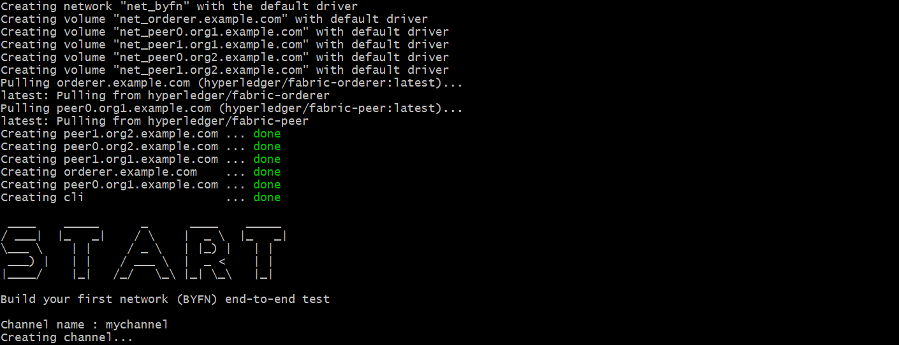
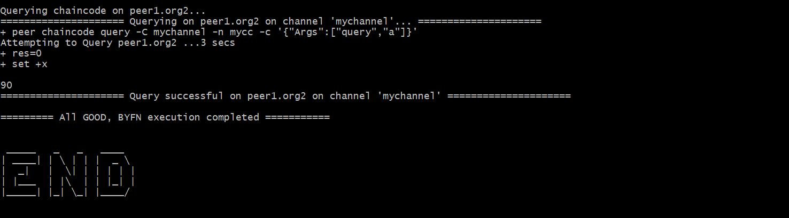

# Installation Guide

> For Linux installation follow [this guide](https://hackernoon.com/hyperledger-fabric-installation-guide-74065855eca9) changing the prerequisite version with the below one

# Table of Contents
- [Prerequisite](#prerequisite)
    1. [cUrl](#curl) - latest version
    2. [Docker & Compose](#docker) (version 17.06.2-ce or greater - I used v18.09.9 | Compose version 1.14.0 or greate)
        - [Installation](#docker_installation)
        - [Test](#docker_test)
    3. [Goland](#go) (version 1.12 or greater - I used v1.14.2)
    4. [Nodejs & npm](#node) (version 8.9.x or greater - I used v10.5.2 | npm version 5.6.0 or greater - I used 6.13.7)
    5. [Python](#python) 2.7
    6. [wget](#wget) - 1.19.1 or greater 
- [Hyperledger Fabric Installation](#fabric_installation)
    1. [Windows Extra](win_extra)
    2. [Git Configuration](#git)
    3. [Download Binaries Samples](#binaries)
    4. [Test Fabric network](#test_fabric)


> I am using Windows 10 Pro and the Fabric v1.4

---

<a name="prerequisite"></a>
# Prerequisite

<a name="curl"></a>
## 1. cUrl

Please check if cURL is already installed in your PC.

```
curl --help
```

If you don’t get any error it means cURL is installed in your PC and you can go
to the next step. For others please follow the below steps.
1. To install cURL, download the package according to your Windows 32/64 bit
from this [link](https://curl.haxx.se/download.html). Extract the package and run the curl.exe present in the bin
folder.
2. Add the curl in the environment variable.
3. Open the cmd and check the curl -help.
If you don’t get any error it means you curl is installed successfully.
Follow this [link](https://stackoverflow.com/questions/9507353/how-do-i-install-and-use-curl-on-windows) for troubleshooting.

<a name="docker"></a>
## 2. Docker & Compose

<a name="docker_installation"></a>
### Installation

Before installing the docker, check if virtualization is Enabled in your PC or not. To
check it, open `Task Manager » Performance Tab » CPU`


<p align="center">
  
 </p>
<p align="center"><b>Figure 1</b>: virtualization</p>  


From the BIOS settings, virtualization can be turned to Enabled. Instructions to
enter BIOS settings vary from the pc manufacturer to manufacturer. Please check
this [link](https://www.wikihow.tech/Enable-Hardware-Virtualization) for the instructions.

Once the virtualization is Enabled we can move to download the docker. Please
be sure which Windows you’re using before installing Docker. There are 2 versions
of Docker for Windows.
1. Docker Toolbox — Windows 8, Windows 10 Home
2. Docker Desktop — Windows 10 Pro, Enterprise — 64 bit
You first need to have an account in DockerHub to download the docker desktop.
Please signup if you don’t have one.

Download the docker from this [link](https://hub.docker.com/editions/community/docker-ce-desktop-windows).

> Note: While installing keep the settings default don’t change anything

<a name="docker_test"></a>
### Test Docker Installation

1. Open the cmd window
2. Run docker -version and docker-compose -version

```
docker --version
Docker version 18.09.2, build 6247962

docker-compose --version
docker-compose version 1.23.2, build 1110ad01
```

Pull the [hello-world image](https://hub.docker.com/_/hello-world) from Docker Hub and run a container with the fol-
lowing command:

```
docker run hello-world
```

<p align="center">
  
 </p>
<p align="center"><b>Figure 2</b>: docker hello-world</p> 

If you get this message then the Docker installed successfully in your machine.
For more information on Docker check the [official documentation](https://docs.docker.com/docker-for-windows/).

<a name="go"></a>
## 3. Goland 

Download the Golang package from the [official site](https://golang.org/dl/).
Once it is installed open the command prompt and run
```
go version
```
Output

```
go version go1.11.5 windows/amd64
```

<a name="node"></a>
## 4. Nodejs and npm

Download the node v8.x or greater from this [link](https://nodejs.org/en/download/) and install it.
Check if it is installed correctly.

```
node -v
v8.16.0

npm -v
6.4.1
```

<a name="python"></a>
## 5. Python

Download the python 2.7 from its [official site](https://www.python.org/downloads/windows/).

While installing add python to the system Path variable. This allows you to type
‘python’ into a command prompt without needing the full path.

Change `Add python.exe to Path` to `Will be installed on the local hard drive`

<p align="center">
  
 </p>
<p align="center"><b>Figure 3</b>: python path</p> 

Check the python installed correctly or not.

```
python --version
Python 2.7.16
```

<a name="wget"></a>
## 6. wget

Please check if wget command is already installed in your PC.

```
wget --help
```

If you don’t get any error it means wget is installed in your PC and you can go
to the next step. For others please follow the below steps.
1. To install wget, download the zip package according to your Windows 32/64
bit from this [link](https://eternallybored.org/misc/wget/). Extract the package inside a folder.
2. Add the path in the environment variable.
3. Open the cmd and check the wget -help.

> Note: install a wget version up to 1.19.1 in order to support tls1.2

---

<a name="fabric_installation"></a>
# Hyperledger Fabric Installation

> One the prerequisites are correctly installed we proceed to install first the extra windows dependencies and second the fabric sample binaries.

<a name="win_extra"></a>
## Windows Extra

### Install windows-build-tools

Install the `windows-build-tools` globally using `npm`.

Open the command `prompt` and run the below command.

```
npm install --global windows-build-tools
```

It will take some time around 15 minutes or more. Once it will complete you will get the below message.

<p align="center">
  
 </p>
<p align="center"><b>Figure 4</b>: windows-build-tools installation</p>

### Install grpc

Once this is done, you should also install the NPM GRPC module with the following command:

```
npm install --global grpc
```
<a name="git"></a>
## Git Configuration

To run the bash commands we have to install `git`.
Download the git from this [link](https://git-scm.com/) and follow the Installation passages.
Open a git bash. Right-click and select Git Bash Here.

<p align="center">
  
 </p>
<p align="center"><b>Figure 5</b>: Git Bash</p>

Once is opened, run the following commands:
```
git config --global core.autocrlf false
git config --global core.longpaths true
```

You can check the setting of these parameters with the following commands:

```
git config --get core.autocrlf
git config --get core.longpaths
```

> Note: Learn more about git at the following [link](https://www.atlassian.com/git/tutorials/git-bash)

<a name="binaries"></a>
## Download Binaries Samples

Go to the directory where you want to download the fabric samples.
Once you’re in the directory open `git bash`

Run the below command to install Samples, Binaries and Docker Images of release `Fabric v1.4.4`

```
curl -sSL http://bit.ly/2ysbOFE | bash -s -- <fabric_version> <fabric-ca_version> <thirdparty_version>

curl -sSL http://bit.ly/2ysbOFE | bash -s -- 1.4.4 1.4.4 0.4.18
```

> Note: In the default version `curl -sSL http://bit.ly/2ysbOFE | bash -s` doen’t work the link.
Check in the [official documentation](https://hyperledger-fabric.readthedocs.io/en/release-1.4/install.html)

It’ll take some time, once it is finished you can see a new directory “fabric-samples”.


<p align="center">
  
 </p>
<p align="center"><b>Figure 6</b>: Fabric Samples</p>

“fabric-samples” come with sample examples to start with Hyperledger Fabric.
There are many good examples to play within the fabric samples.


<a name="test_fabric"></a>
## Test fabric network

As we have successfully completed the setting up the Fabric environment, it’s time
to test it. We are going to use the first-network sample from the fabric-samples.

Open the `fabric-samples` and go to `first-network`.

```
cd fabric-samples/first-network
```
<p align="center">
  
 </p>
<p align="center"><b>Figure 7</b>: first network</p>


To test it, run the byfn.sh. It is a test script, it first setup the network with 2 **organizations** Org1 and Org2 with 2 **peers** each and an **orderer**.

```
./byfn.sh up
```

<p align="center">
  
 </p>
<p align="center"><b>Figure 8</b>: first network start</p>

On successful execution, you’ll see the below message.


<p align="center">
  
 </p>
<p align="center"><b>Figure 9</b>: first network end</p>

> Note: If there’s already a Compose network up and running you could have error. Use the following command `docker rm $(docker ps -qa)` to shutting down all containers in running and run again `./byfn.sh`

If you reach till this point it means you have successfully setup the fabric network. Now, we have completed the testing of first-network, clean the network.

```
./byfn.sh down
```

**Here, we have completed the Hyperledger Fabric installation in the Windows machine.**


