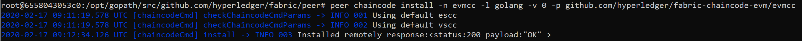
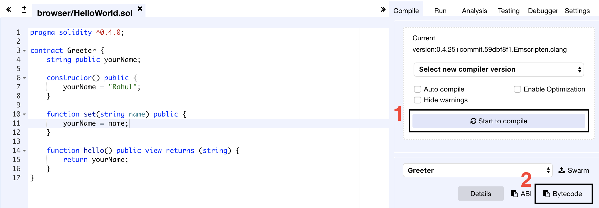
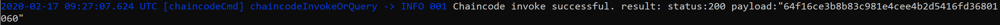
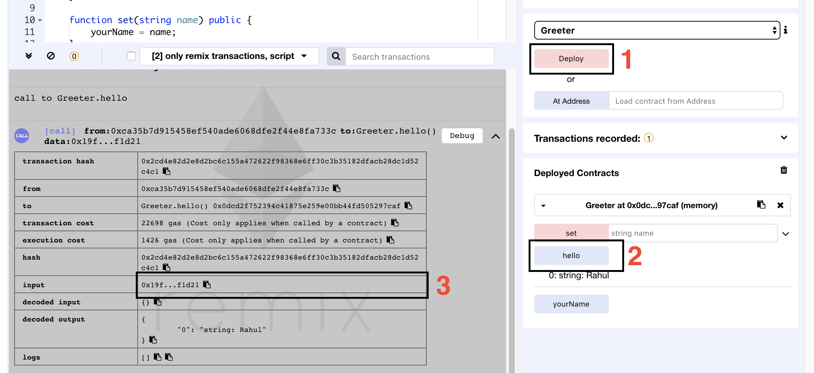
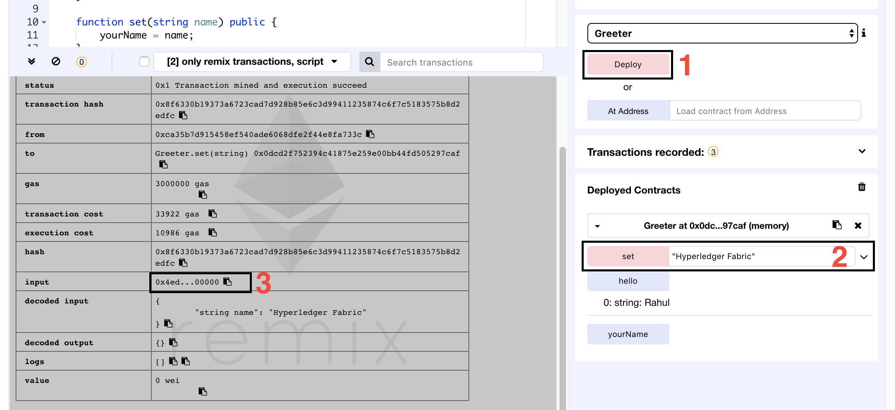

# Solidity Smart Contract on Hyperledger Fabric

> This Guide show how to run a simple Solidity Smart Contract over Hyperledger Fabric network

# Table of Contents

1. [Prerequisites Intructions](#prerequisite)
2. [Setting up](#set_up)
    - [Mount the EVM Chaincode](#mount)
    - [Build and Start the EVM](#build_evm)
3. [Test evm chaincode](#test)

---

<a name="prerequisite"></a>
## 1. Prerequisites Intructions

To test the solidity smart contract we start by "first-network". [documentation](https://hyperledger-fabric.readthedocs.io/en/release-1.4/prereqs.html).

1. fabric-samples installation - follow the previous [guide](/fabric_installation_guide.md)
2. clone this [git repository](https://github.com/hyperledger/fabric-chaincode-evm), which is a chaincode EVM (Ethereum Virtual Machine) based on the Hyperledger Burrow.
3. open [Remix](https://remix.ethereum.org/), our Solidity testing environment

<a name="set_up"></a>
## 2. Setting Up

<a name="mount"></a>
### Mount the EVM Chaincode

First of all, navigate to the `first-network` folder inside `fabric-samples` and make
a slight modification in the `docker-compose-cli.yaml`. We will map the location
of `fabric-chaincode-evm` folder that we have cloned from the git repository to our
`cli` container. So add the following line to the `services >> cli >> volumes`

```
services:
        ...
        cli:
            ....
            volumes:
                - ....
                - <location fabric-chaincode-evm>:/opt/gopath/src/github.com/hyperledger/fabric-chaincode-evm
```

Now always in git bash start the network with:

```
./byfn.sh up
```

<a name="build_evm"></a>
## Build and Start the EVM

Once everything is ready, open `cmd` and go into the `cli` container with the command:


```bash
docker exec -it cli bash
```

> Note: git bash not support -it

install the EVM chaincode on all the peers


```bash
peer chaincode install -n evmcc -l golang -v 0 -p github.com/hyperledger/fabric-chaincode-evm/evmcc
```


<p align="center">
  
 </p>
<p align="center"><b>Figure 1</b>: evm chaincode installation output</p>  

Since, you did a fresh login to the cli container, the environment variables are set to indicate Peer 0 or the Org1. If not, to change which peer is targeted change the following environment variables:

```bash
export CORE_PEER_MSPCONFIGPATH=/opt/gopath/src/github.com/hyperledger/fabric/peer/crypto/peerOrganizations/org1.example.com/users/Admin@org1.example.com/msp
export CORE_PEER_ADDRESS=peer0.org1.example.com:7051
export CORE_PEER_LOCALMSPID="Org1MSP"
export CORE_PEER_TLS_ROOTCERT_FILE=/opt/gopath/src/github.com/hyperledger/fabric/peer/crypto/peerOrganizations/org1.example.com/peers/peer0.org1.example.com/tls/ca.crt
```

It’s time to instantiate our EVM chaincode. I will only do it for one peer, as my main objective here is to tell you how to execute a Smart Contract. Instantiate the evmcc and replace `<channel-name>` with the channel name
    
```bash
peer chaincode instantiate -n evmcc -v 0 -C <channel-name> -c ’{"Args":[]}’ -o orderer.example.com:7050 --tls --cafile /opt/gopath/src/github.com/hyperledger/fabric/peer/crypto/ordererOrganizations/example.com/orderers/orderer.example.com/msp/tlscacerts/tlsca.example.com-cert.pem

peer chaincode instantiate -n evmcc -v 0 -C mychannel -c ’{"Args":[]}’ -o orderer.example.com:7050 --tls --cafile /opt/gopath/src/github.com/hyperledger/fabric/peer/crypto/ordererOrganizations/example.com/orderers/orderer.example.com/msp/tlscacerts/tlsca.example.com-cert.pem
```

> Now we have got our EVM running on Hyperledger Fabric. Go to the next step to test with a sample.


## 3. Test evm chaincode

Go into [Remix](https://remix.ethereum.org/), and write a Smart Contract of your choice. The example on [this page](https://github.com/hyperledger/fabric-chaincode-evm/blob/master/examples/EVM_Smart_Contracts.md) shows [Simple Storage](https://solidity.readthedocs.io/en/v0.4.24/introduction-to-smart-contracts.html) contract, but we are going to work with a simple **Greeter** Smart Contract. The code is as follows:

```javascript
pragma solidity ^0.4.0;
contract Greeter {
    string public yourName;
    
    constructor() public {
        yourName = "Rahul";
    }

    function set(string name) public {
        yourName = name;
    }

    function hello() public view returns (string) {
        return yourName;
    }
}
```

Compile the SmartContract (1), and click Bytecode (2) to copy the Bytecode than paste it in a text editor in order to manipulate output.

<p align="center">
  
 </p>
<p align="center"><b>Figure 2</b>: compile and copy bytecode</p>  

The copied text will be a JSON document. We are only interested in the value of **object** field of that document, which would look something like this:

```
608060405234801561001057600080fd5b506040805190810160405280600581526020017f526168756c0000000000000000000000000000000000000000000000000000008152506000908051906020019061005c929190610062565b50610107565b828054600181600116156101000203166002900490600052602060002090601f016020900481019282601f106100a357805160ff19168380011785556100d1565b828001600101855582156100d1579182015b828111156100d05782518255916020019190600101906100b5565b5b5090506100de91906100e2565b5090565b61010491905b808211156101005760008160009055506001016100e8565b5090565b90565b610410806101166000396000f300608060405260043610610057576000357c0100000000000000000000000000000000000000000000000000000000900463ffffffff16806319ff1d211461005c5780634ed3885e146100ec578063d97d663014610155575b600080fd5b34801561006857600080fd5b506100716101e5565b6040518080602001828103825283818151815260200191508051906020019080838360005b838110156100b1578082015181840152602081019050610096565b50505050905090810190601f1680156100de5780820380516001836020036101000a031916815260200191505b509250505060405180910390f35b3480156100f857600080fd5b50610153600480360381019080803590602001908201803590602001908080601f0160208091040260200160405190810160405280939291908181526020018383808284378201915050505050509192919290505050610287565b005b34801561016157600080fd5b5061016a6102a1565b6040518080602001828103825283818151815260200191508051906020019080838360005b838110156101aa57808201518184015260208101905061018f565b50505050905090810190601f1680156101d75780820380516001836020036101000a031916815260200191505b509250505060405180910390f35b606060008054600181600116156101000203166002900480601f01602080910402602001604051908101604052809291908181526020018280546001816001161561010002031660029004801561027d5780601f106102525761010080835404028352916020019161027d565b820191906000526020600020905b81548152906001019060200180831161026057829003601f168201915b5050505050905090565b806000908051906020019061029d92919061033f565b5050565b60008054600181600116156101000203166002900480601f0160208091040260200160405190810160405280929190818152602001828054600181600116156101000203166002900480156103375780601f1061030c57610100808354040283529160200191610337565b820191906000526020600020905b81548152906001019060200180831161031a57829003601f168201915b505050505081565b828054600181600116156101000203166002900490600052602060002090601f016020900481019282601f1061038057805160ff19168380011785556103ae565b828001600101855582156103ae579182015b828111156103ad578251825591602001919060010190610392565b5b5090506103bb91906103bf565b5090565b6103e191905b808211156103dd5760008160009055506001016103c5565b5090565b905600a165627a7a72305820c12385aeb898000455ce9dba7b842c2ed4558ec55f67fe5872bcd030fa62818b0029
```
This is our Bytecode, and to install it in our Hyperledger Fabric EVM, we will do a **peer chaincode invoke**

```bash
peer chaincode invoke -n evmcc -C mychannel -c ’"Args":[" 0000000000000000000000000000000000000000","608060405234801561001057600080fd5b506040805190810160405280600581526020017f526168756c0000000000000000000000000000000000000000000000000000008152506000908051906020019061005c929190610062565b50610107565b828054600181600116156101000203166002900490600052602060002090601f016020900481019282601f106100a357805160ff19168380011785556100d1565b828001600101855582156100d1579182015b828111156100d05782518255916020019190600101906100b5565b5b5090506100de91906100e2565b5090565b61010491905b808211156101005760008160009055506001016100e8565b5090565b90565b610410806101166000396000f300608060405260043610610057576000357c0100000000000000000000000000000000000000000000000000000000900463ffffffff16806319ff1d211461005c5780634ed3885e146100ec578063d97d663014610155575b600080fd5b34801561006857600080fd5b506100716101e5565b6040518080602001828103825283818151815260200191508051906020019080838360005b838110156100b1578082015181840152602081019050610096565b50505050905090810190601f1680156100de5780820380516001836020036101000a031916815260200191505b509250505060405180910390f35b3480156100f857600080fd5b50610153600480360381019080803590602001908201803590602001908080601f0160208091040260200160405190810160405280939291908181526020018383808284378201915050505050509192919290505050610287565b005b34801561016157600080fd5b5061016a6102a1565b6040518080602001828103825283818151815260200191508051906020019080838360005b838110156101aa57808201518184015260208101905061018f565b50505050905090810190601f1680156101d75780820380516001836020036101000a031916815260200191505b509250505060405180910390f35b606060008054600181600116156101000203166002900480601f01602080910402602001604051908101604052809291908181526020018280546001816001161561010002031660029004801561027d5780601f106102525761010080835404028352916020019161027d565b820191906000526020600020905b81548152906001019060200180831161026057829003601f168201915b5050505050905090565b806000908051906020019061029d92919061033f565b5050565b60008054600181600116156101000203166002900480601f0160208091040260200160405190810160405280929190818152602001828054600181600116156101000203166002900480156103375780601f1061030c57610100808354040283529160200191610337565b820191906000526020600020905b81548152906001019060200180831161031a57829003601f168201915b505050505081565b828054600181600116156101000203166002900490600052602060002090601f016020900481019282601f1061038057805160ff19168380011785556103ae565b828001600101855582156103ae579182015b828111156103ad578251825591602001919060010190610392565b5b5090506103bb91906103bf565b5090565b6103e191905b808211156103dd5760008160009055506001016103c5565b5090565b905600a165627a7a72305820c12385aeb898000455ce9dba7b842c2ed4558ec55f67fe5872bcd030fa62818b0029"]’ -o orderer.example.com:7050 –tls –cafile /opt/gopath/src/github.com/hyperledger/fabric/peer/crypto/ordererOrganizations/example.com/orderers/orderer.example.com/msp/tlscacerts/tlsca.example.com-cert.pem
```

There are two arguments provided to the invoke this time. The first one, which was traditionally supposed to be a function name inside the chaincode `<contract-address>`, is now `0000000000000000000000000000000000000000`; and the second argument is our Solidity Smart Contract Bytecode. The response of this execution will generate a **payload**, which is the Smart Contract address. Copy that address as we would need it to execute our the Smart Contract functions.

<p align="center">
  
 </p>
<p align="center"><b>Figure 3</b>: Copy the payload generated above</p>

Now, to execute functions, we will use invoke and query too, but with different parameters. My contract contains two functions `hello` and `set`. The first thing we need to do is to acquire hash of our function execution. And the simplest way to do that is to execute those functions in **Remix**, and then copy the hash from the transaction block.

So first of all **(1)** deploy the contract, **(2)** click the `hello` button to execute our function, and **(3)** copy the value of `input` field from the transaction block, and remove 0x from the value.

<p align="center">
  
 </p>
<p align="center"><b>Figure 4</b>: 1 Deploy; 2. Click Hello; 3. Copy the value of input field</p>

To execute the same function on Hyperledger Fabric EVM, we will do a query. This time, the first parameter is our Smart Contract address (payload from above), and second is the hash of function (copied from the transaction log of Remix).

```bash
peer chaincode query -n evmcc -C mychannel -c ’{"Args":[<payload>, <input-without-0x>]}’
    
peer chaincode query -n evmcc -C mychannel -c ’{"Args":["3a487839058aa701ae277cc416f13aab6e737dc4","19ff1d21"]}’
```

It’s time to update the name inside our Greeter Smart Contract using the “set” function. So again in the Remix, enter a name in the text field besides set button, click set (2), and copy the function hash from the input field, again without 0x (3). This time the hash value will correspond to both function name and its parameter. Hence if you change the function parameter, a part of the hash will change.


<p align="center">
  
 </p>
<p align="center"><b>Figure 4</b>: 1 Deploy; 2. Click Hello; 3. Copy the value of input field</p>

The `hash` without 0x would look like this:
```
4ed3885e0000000000000000000000000000000000000000000000000000000000000020000000000000000000000000000000000000000000000000000000000000001248797065726c6564676572204661627269630000000000000000000000000000
```

As it is an update transaction, we will do an **`invoke`** this time. The command will be

```
peer chaincode invoke -n evmcc -C mychannel -c ’{"Args":["<hash-without-0x>"]}’ -o orderer.example.com:7050 --tls --cafile /opt/gopath/src/github.com/hyperledger/fabric/peer/crypto/ordererOrganizations/example.com/orderers/orderer.example.com/msp/tlscacerts/tlsca.example.com-cert.pem
```

You can verify the update, by running the previous command again:

```
peer chaincode query -n evmcc -C mychannel -c ’{"Args":["3a487839058aa701ae277cc416f13aab6e737dc4","19ff1d21"]}’
```
